# S2N v1.0.0 Refactoring Plan

> **목표**: 코드 품질·안정성·유지보수성을 높여 v1.0.0 릴리즈에 적합한 상태로 만든다.
> **분석 기준**: `docs/interfaces.*.md` 명세, 7개 플러그인 구현체, `scan_engine.py`, CLI, CI/CD 파이프라인, 테스트 커버리지

---

## 우선순위 요약

| 순위   | 영역                         | 핵심 문제                                                          | 영향도      |
| ------ | ---------------------------- | ------------------------------------------------------------------ | ----------- |
| **#1** | 플러그인 코드 정규화         | 인터페이스·패턴 불일치, 중복 코드                                  | 🔴 Critical |
| **#2** | `scan_engine.py` 함수 복잡도 | 710줄 단일 파일, 메서드당 100+줄                                   | 🔴 Critical |
| **#3** | 예외 처리 체계               | `S2NException` 미사용, bare except, 에러 정보 유실                 | 🟠 High     |
| **#4** | 실행 환경 안정성             | `datetime.now()` / `utcnow()` 혼용, 리소스 미해제, 타임아웃 불일치 | 🟠 High     |
| **#5** | CI/CD 파이프라인 강화        | lint/타입체크 부재, 보안 스캐닝 없음, 단계 중복                    | 🟡 Medium   |

---

## #1. 플러그인 코드 정규화 (Priority: Critical)

### 현황 분석

7개 플러그인이 통일된 인터페이스 없이 각자 다른 패턴으로 구현되어 있다.

#### 1-1. `__init__` 파라미터 타입 불일치

| 플러그인               | `__init__` config 타입        | 비고           |
| ---------------------- | ----------------------------- | -------------- |
| `SQLInjectionPlugin`   | `Optional[Dict[str, Any]]`    |                |
| `XSSScanner`           | `PluginConfig \| None`        |                |
| `CSRFScanner`          | `Optional[PluginConfig]`      |                |
| `BruteForcePlugin`     | `Any`                         |                |
| `FileUploadPlugin`     | `Optional[PluginContext]`     | ⚠️ 잘못된 타입 |
| `OSCommandPlugin`      | `Optional[Dict[str, object]]` |                |
| `SoftBruteForcePlugin` | `Optional[Dict[str, Any]]`    |                |

#### 1-2. 헬퍼 함수 사용 불일치

- `sqlinjection`: `helper.py`의 `resolve_client`, `resolve_depth`, `resolve_target_url` 사용
- `xss`, `csrf`, `file_upload`: `plugin_context.scan_context.http_client`에 직접 접근
- `oscommand`, `soft_brute_force`: 자체 `_resolve_*` 메서드를 인스턴스에 중복 구현

#### 1-3. 클래스명·export 불일치

| 플러그인         | 클래스명               | `__init__.py` export                                      |
| ---------------- | ---------------------- | --------------------------------------------------------- |
| sqlinjection     | `SQLInjectionPlugin`   | `main as Plugin`                                          |
| xss              | `XSSScanner`           | `main as Plugin`                                          |
| csrf             | `CSRFScanner`          | `main as Plugin`                                          |
| soft_brute_force | `SoftBruteForcePlugin` | `SoftBruteForcePlugin, main as Plugin` (불필요 이중 노출) |

#### 1-4. 레거시 인터페이스 잔재

`OSCommandPlugin`에만 `initialize()`, `scan()`, `teardown()` 레거시 메서드 존재 → 다른 플러그인에는 없음.

### 리팩터링 방향

```python
# 1. 공통 추상 베이스 클래스 (ABC) 또는 Protocol 정의
class BasePlugin(Protocol):
    name: str
    description: str

    def __init__(self, config: Optional[PluginConfig] = None) -> None: ...
    def run(self, plugin_context: PluginContext) -> PluginResult: ...
```

- 모든 `__init__` config 타입을 `Optional[PluginConfig]`으로 통일
- `helper.py`의 `resolve_*` 함수를 `BasePlugin` 메서드 또는 `PluginContext` 메서드로 이동
- `OSCommandPlugin`의 레거시 `initialize/scan/teardown` 제거
- `__init__.py` export 패턴 통일: `from .xxx_main import main as Plugin`만 노출

### 대상 파일

- `s2n/s2nscanner/plugins/helper.py`
- `s2n/s2nscanner/plugins/*/__init__.py` (7개)
- `s2n/s2nscanner/plugins/*/XXX_main.py` (7개)

---

## #2. `scan_engine.py` 함수 복잡도 분해 (Priority: Critical)

### 현황 분석

| 메서드                     | 줄 수 | 문제점                                                                           |
| -------------------------- | ----- | -------------------------------------------------------------------------------- |
| `Scanner.__init__`         | 50줄  | 파라미터 11개, 복잡한 초기화 로직                                                |
| `Scanner.scan`             | 106줄 | 플러그인 루프 + 에러 핸들링 + 리포트 생성이 하나에 혼합                          |
| `Scanner._run_plugin`      | 109줄 | pre_scan/run/post_scan/cleanup 4단계 + 결과 정규화 + 레거시 호환까지 단일 메서드 |
| `Scanner.discover_plugins` | 61줄  | 동적 모듈 로딩 + 필터링 + 정렬이 혼합                                            |

총 24개 메서드, 710줄이 하나의 클래스에 응집되어 있음.

### 리팩터링 방향

```
scan_engine.py (710줄)
  ↓ 분리
scanner.py          # Scanner 클래스 - scan() 오케스트레이션만
plugin_runner.py    # _run_plugin 로직 (lifecycle: pre_scan → run → post_scan → cleanup)
plugin_loader.py    # discover_plugins, _apply_plugin_ordering
result_normalizer.py # _normalize_findings, _dict_to_finding, _normalize_severity/confidence
```

- `scan()` 메서드: 플러그인 루프와 리포트 생성을 분리
- `_run_plugin()`: 4단계 lifecycle을 명시적 함수로 추출
- 결과 정규화 로직은 `finding.py`로 이관 (이미 관련 함수 존재)

### 대상 파일

- `s2n/s2nscanner/scan_engine.py` → 분리 대상
- `s2n/s2nscanner/finding.py` → 정규화 로직 이관

---

## #3. 예외 처리 체계 통일 (Priority: High)

### 현황 분석

#### 3-1. `S2NException` 계층 미사용

`docs/interfaces.*.md`에 `S2NException` 하위 6개 클래스가 정의됨 (`NetworkError`, `AuthenticationError`, `ConfigurationError`, `PluginError`, `CrawlerError`, `ValidationError`). 그러나 실제 코드에서는 `interfaces.py`에 `PluginError` dataclass만 정의, 나머지 예외 클래스 **미구현**.

#### 3-2. 플러그인 에러 핸들링 불일치

| 플러그인         | `traceback` 필드                       | catch 범위  |
| ---------------- | -------------------------------------- | ----------- |
| sqlinjection     | `str(e.__traceback__)` (주소값만 출력) | `Exception` |
| xss              | `str(e.__traceback__)`                 | `Exception` |
| csrf             | `str(e.__traceback__)`                 | `Exception` |
| soft_brute_force | `None` (하드코딩)                      | `Exception` |
| oscommand        | traceback 모듈 사용                    | `Exception` |

→ `PluginError.traceback`에 실제 traceback 문자열이 아닌 `<traceback object>` 주소가 들어감.

#### 3-3. 에러 복구 가능 여부 미표시

`ErrorReport.recoverable` 필드가 docs에 정의되어 있으나 구현/사용되지 않음.

### 리팩터링 방향

1. `interfaces.py`에 `S2NException` 계층 구현 (docs 명세 기준)
2. `traceback` 필드: `traceback.format_exc()` 사용으로 통일
3. 플러그인별 에러 핸들링을 공통 데코레이터 또는 래퍼로 추출

```python
import traceback

# PluginError 생성 시
PluginError(
    error_type=type(e).__name__,
    message=str(e),
    traceback=traceback.format_exc(),  # 실제 스택트레이스 문자열
)
```

### 대상 파일

- `s2n/s2nscanner/interfaces.py` → `S2NException` 계층 추가
- `s2n/s2nscanner/plugins/*/XXX_main.py` (7개) → traceback 처리 통일
- `s2n/s2nscanner/scan_engine.py` → 예외 유형별 분기 처리

---

## #4. 실행 환경 안정성 (Priority: High)

### 현황 분석

#### 4-1. `datetime.now()` vs `datetime.utcnow()` 혼용

| 위치                                        | 사용                | 비고             |
| ------------------------------------------- | ------------------- | ---------------- |
| `scan_engine.py`                            | `datetime.utcnow()` |                  |
| `sqlinjection/sqli_main.py`                 | `datetime.now()`    | ⚠️ 시간대 불일치 |
| `xss/xss_main.py`                           | `datetime.now()`    | ⚠️               |
| `csrf/csrf_main.py`                         | `datetime.now()`    | ⚠️               |
| `file_upload/file_upload_main.py`           | `datetime.now()`    | ⚠️               |
| `soft_brute_force/soft_brute_force_main.py` | `datetime.utcnow()` |                  |
| `finding.py`                                | `datetime.now()`    | ⚠️               |

> `datetime.utcnow()`은 Python 3.12+에서 deprecated 예정. `datetime.now(timezone.utc)` 사용 권장.

#### 4-2. Selenium WebDriver 리소스 관리

`brute_force_selenium.py`에서 Selenium WebDriver를 사용하지만, `BruteForcePlugin`에는 `cleanup/teardown`이 없어 **WebDriver 세션 누수** 가능.

#### 4-3. 타임아웃 설정 불일치

- `ScannerConfig.timeout = 30`초가 기본값이나, 각 플러그인이 독자적으로 `timeout=5`, `timeout=10` 등 하드코딩.
- `file_upload_main.py`에서 `http_client.get(url, timeout=10)` 하드코딩.

#### 4-4. 스레드 안전성

`ScannerConfig.max_threads = 5`가 정의되어 있지만, 현재 플러그인 실행은 **순차 실행** (`for` 루프). `max_threads` 설정이 실질적 효과 없음 → 문서와 코드 불일치.

### 리팩터링 방향

1. 프로젝트 전체에서 `datetime.now(timezone.utc)` 통일
2. Selenium 사용 플러그인에 `cleanup()` lifecycle 메서드 추가
3. 플러그인 내 하드코딩된 timeout을 `PluginConfig.timeout`에서 가져오도록 수정
4. `max_threads` 설정에 대해: 병렬 실행 미구현이면 docs/config에서 제거, 또는 `concurrent.futures`로 실제 구현

### 대상 파일

- `s2n/s2nscanner/plugins/*/XXX_main.py` (7개) → datetime 통일
- `s2n/s2nscanner/finding.py` → datetime 통일
- `s2n/s2nscanner/scan_engine.py` → datetime 통일, 병렬 실행 검토
- `s2n/s2nscanner/plugins/brute_force/brute_force_selenium.py` → cleanup 추가

---

## #5. CI/CD 파이프라인 강화 (Priority: Medium)

### 현황 분석

#### 5-1. Lint / 타입체크 부재

`ci-cd.yml`, `dev.yml` 모두 `pytest` 실행만 존재. `ruff`/`flake8`/`mypy` 등의 정적 분석 단계 없음.

#### 5-2. 보안 스캐닝 부재

보안 스캐너 프로젝트임에도 CI에 의존성 보안 스캐닝(`pip-audit`, `safety`, `dependabot`) 없음.

#### 5-3. dev.yml 단계 중복 및 비효율

```yaml
# dev.yml 문제점
- name: Install build deps (optional)
  if: always()  # ← 테스트 실패해도 무조건 실행
  run: python -m pip install --upgrade build

- name: Build Python package (optional)
  if: always()  # ← 테스트 실패해도 무조건 빌드
  run: python -m build || echo "Build failed or skipped"  # ← 에러 무시
```

#### 5-4. Coverage 리포트 미생성

`dev.yml`에서 `--cov-report=term-missing`만 사용, XML 리포트 미생성 → Codecov 업로드(`file: ./coverage.xml`)에서 항상 실패.

#### 5-5. ci-cd.yml 조건 식 연산자 우선순위 문제

```yaml
# 현재 (잠재적 버그)
if: github.event_name == 'release' && github.event.action == 'published' || startsWith(github.ref, 'refs/tags/v')
# → (release && published) || tag-push

# 의도한 것
if: (github.event_name == 'release' && github.event.action == 'published') || startsWith(github.ref, 'refs/tags/v')
```

### 리팩터링 방향

```yaml
# ci-cd.yml에 추가할 단계
jobs:
  lint:
    runs-on: ubuntu-latest
    steps:
      - uses: actions/checkout@v4
      - uses: actions/setup-python@v5
        with: { python-version: "3.11" }
      - run: pip install ruff mypy
      - run: ruff check s2n/
      - run: mypy s2n/ --ignore-missing-imports

  security:
    runs-on: ubuntu-latest
    steps:
      - uses: actions/checkout@v4
      - run: pip install pip-audit
      - run: pip-audit .
```

- `dev.yml`의 `if: always()` 제거, 에러 무시 패턴 정리
- Coverage XML 리포트 생성 추가 (`--cov-report=xml`)
- Deploy 조건에 명시적 괄호 추가

### 대상 파일

- `.github/workflows/ci-cd.yml`
- `.github/workflows/dev.yml`
- `pyproject.toml` → `[tool.ruff]`, `[tool.mypy]` 설정 추가

---

## 작업 순서 로드맵

```mermaid
gantt
    title v1.0.0 Refactoring Roadmap
    dateFormat X
    axisFormat %s

    section Phase 1 (Foundation)
    #1 플러그인 정규화       :a1, 0, 5
    #3 예외 처리 체계        :a3, 0, 3

    section Phase 2 (Core)
    #2 scan_engine 분해      :a2, 5, 8
    #4 실행 환경 안정성      :a4, 3, 6

    section Phase 3 (Infra)
    #5 CI/CD 강화            :a5, 6, 8
```



**Phase 1** (#1 + #3): 플러그인 인터페이스 통일 + 예외 체계 구현 → 이후 리팩터링의 기반
**Phase 2** (#2 + #4): scan_engine 분해 + datetime/timeout/리소스 안정화
**Phase 3** (#5): CI/CD에 lint/타입체크/보안스캐닝 추가로 이후 회귀 방지
