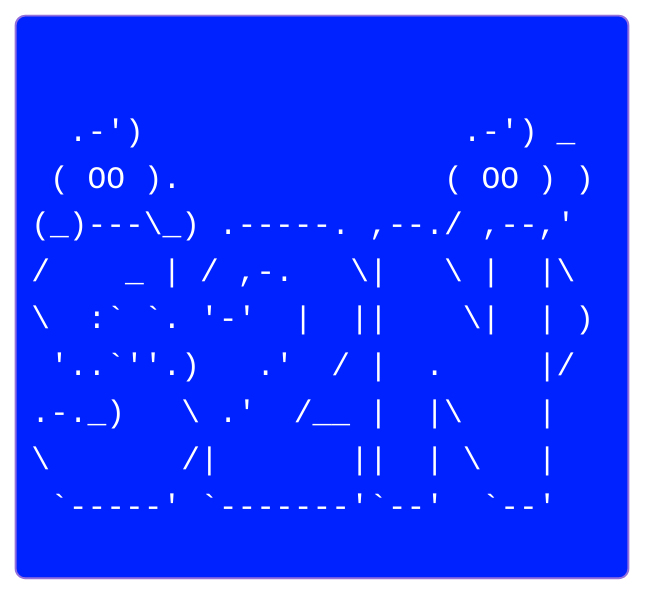

# S2N — Plugin-based Web Vulnerability Scanner

[](https://pypi.org/project/s2n/)
[](https://pypi.org/project/s2n/)
[](https://opensource.org/licenses/MIT)



> A lightweight, plugin-driven web vulnerability scanner library.
> Core data types and interfaces are defined in `s2n.s2nscanner.interfaces`.
> More detailed type Documentation is available in [`interfaces.en.md`](/docs/interfaces.en.md).

---

- [PyPi s2n](https://pypi.org/project/s2n/)
- [Korean Documentation](./README.ko.md)

---

## Quick install

### CLI Usage

Execute a scan from the command line:

```bash
s2n scan \
  --url http://target.com \
  --all \
  --auth auto \
  --username admin \
  --password pass \
  --output-format html \
  --output results.html
```

Common options:

- `-u, --url`: Target URL to scan (Required)
- `-p, --plugin`: Select specific plugins (multiple allowed)
- `--all`: Run all default plugins
- `-a, --auth`: Authentication type (NONE, BASIC, BEARER, AUTO, etc.)
- `--login-url`: Login page URL for automatic authentication
- `-o, --output`: Save results to a file
- `--output-format`: Output format (JSON, HTML, CSV, CONSOLE, MULTI)
- `--crawler-depth`: Set crawling depth (Default: 2)
- `-v, --verbose`: Enable detailed logging

### Chrome Extension Usage (GUI)

S2N provides a user-friendly scanning experience via a Chrome Extension alongside the CLI. Follow these steps to link the extension with your local S2N host.

1. **Install Extension**: Install the S2N Scanner extension from the Chrome Web Store or via Developer Mode.
2. **Link Host**: Run the following command in your terminal to install the Native Messaging Host. This establishes communication between your browser and the local scanner. (It will automatically link to the official default Extension ID)
   ```bash
   s2n install-gui
   ```
3. Restart your browser and click the extension icon to start scanning.

### Python usage

```python
from s2n import Scanner, ScanConfig, PluginConfig, AuthConfig
from s2n.interfaces import Severity, AuthType

# Create ScanConfig
config = ScanConfig(
    target_url="http://target.com",
    scanner_config=ScannerConfig(crawl_depth=3),
    plugin_configs={
        "sql": PluginConfig(
            enabled=True,
            max_payloads=50
        )
    },
    auth_config=AuthConfig(
        auth_type=AuthType.BASIC,
        username="admin",
        password="pass"
    )
)

# Execute Scan with ScanConfig parameter
scanner = Scanner(config)
report = scanner.scan()

# 결과 처리
print(f"[RESULT]: {report.summary.total_vulnerabilities}개")
for result in report.plugin_results:
    for finding in result.findings:
        if finding.severity in [Severity.CRITICAL, Severity.HIGH]:
            print(f"[{finding.severity}] {finding.title}")

```

---

## Key type references

### Documentation

- Data type reference: `interfaces.en.md`
- Source: `interfaces.py`

### Core types and data models:

- `s2n.s2nscanner.interfaces.ScanConfig`
- `s2n.s2nscanner.interfaces.PluginConfig`
- `s2n.s2nscanner.interfaces.ScannerConfig`

### Results & reporting:

- `s2n.s2nscanner.interfaces.ScanReport`
- `s2n.s2nscanner.interfaces.Finding`

### Enums:

- `s2n.s2nscanner.interfaces.Severity`
- `s2n.s2nscanner.interfaces.PluginStatus`

## Features

- Plugin-based Architecture: Modular vulnerability checks for easy expansion.
- Advanced Crawling & Discovery: Universal login support and automatic attack point detection.
- Supported Plugins: SQL Injection, XSS, CSRF, JWT, OS Command Injection, File Upload, Brute Force, etc.
- Multiple UI Clients: Powerful CLI and Chrome Extension GUI for various workflows.
- Rich Reporting: Structured data models with support for JSON, HTML, CSV, and Console outputs.
- Cross-Platform Support: Optimized detection patterns for Windows, Linux, and macOS environments.
- Automated Testing: Integrated CI/CD support for security regression testing.

---

## LICENSE

---

## Contributing

Follow the project coding style and add tests for new features.  
Update type docs in interfaces.en.md when interfaces change.

---
